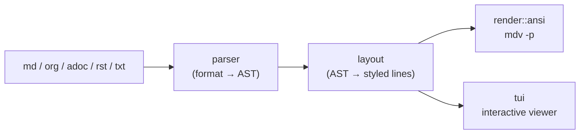

<h1 align="center">mdv</h1>

<p align="center">
  A fast terminal viewer for <b>Markdown</b>, <b>Org</b>, <b>AsciiDoc</b>, <b>reStructuredText</b> and plain text.
</p>

<p align="center">
  <a href="https://github.com/qobulovasror/mdviewer-rc/actions/workflows/ci.yml"></a>
  <a href="LICENSE"></a>
  
  
</p>

<p align="center">
  
</p>

`mdv` renders documents with colors, tables, syntax-highlighted code and clickable links. Read them in
a full-screen viewer with a table of contents, search and live reload, or pipe the rendered text to
stdout. It is a single binary, starts in milliseconds and needs no configuration.

```sh
mdv README.md        # read
mdv docs/            # browse a folder
mdv -w notes.md      # live reload while you edit
mdv -p x.md | less -R
```

## Why mdv?

| | mdv | glow | mdcat | bat |
|---|:-:|:-:|:-:|:-:|
| Rendered Markdown | ✅ | ✅ | ✅ | ❌ source only |
| Interactive full-screen viewer | ✅ | ✅ | ❌ | ❌ |
| Table of contents panel | ✅ | ❌ | ❌ | ❌ |
| Follow links between local documents | ✅ | ❌ | ❌ | ❌ |
| Live reload on file change | ✅ | ❌ | ❌ | ❌ |
| Inline images (Kitty / iTerm2 / Sixel) | ✅ | ❌ | ✅ | ❌ |
| Org, AsciiDoc, reStructuredText | ✅ | ❌ | ❌ | ❌ source only |
| Directory browsing | ✅ | ✅ | ❌ | ❌ |
| Syntax-highlighted code blocks | ✅ | ✅ | ✅ | ✅ |

<sub>Comparison as of 2026, based on each tool's default features.</sub>

## Features

- **Rendering**: headings, emphasis, inline code, lists (nested, ordered, task lists), tables
  with alignment and column fitting, block quotes, GitHub admonitions (`> [!NOTE]`), footnotes,
  definition lists, horizontal rules and front matter.
- **Code blocks** are syntax highlighted with bat's syntax set. The language comes from the fence or
  a shebang line.
- **Links** are clickable (OSC 8) in print mode. In the viewer, follow them with `Tab`/`Enter`.
  Local documents open in place.
- **Images** appear inline on Kitty, iTerm2, WezTerm, Ghostty and other graphics-capable terminals.
  Other terminals show `[🖼 alt]`.
- **Math**: `$\sum_{i=1}^n x_i^2$` renders as `∑ᵢ₌₁ⁿ xᵢ²`. Also **emoji** shortcodes (`:rocket:` → 🚀)
  and common inline HTML (`<kbd>`, `<sup>`, ``, `<a>`).
- **Viewer**: vim/less keys, regex search, link navigation with history, bookmarks, copy a code block,
  `$EDITOR` integration, a remembered reading position, focus (max-width) mode, a file panel and a
  fuzzy finder.
- **Themes**: `dark`, `light`, `dracula`, `nord` and `gruvbox`. The default follows the terminal
  background. Colors fall back to 256/16 colors, and `NO_COLOR` is honored.

> [!TIP]
> Press `?` in the viewer to see every key, and `i` for document info and front matter.

## Install

```sh
cargo install --git https://github.com/qobulovasror/mdviewer-rc   # latest source
cargo install --path .                                           # from a local clone
```

Prebuilt binaries for macOS, Linux and Windows are attached to
[GitHub releases](https://github.com/qobulovasror/mdviewer-rc/releases). A Homebrew formula template
lives in [`packaging/mdv.rb`](packaging/mdv.rb).

## Usage

```sh
mdv README.md                       # open the viewer
mdv docs/                           # directory mode: file panel + README/index
mdv -p README.md                    # print rendered output
mdv -w notes.md                     # reload when the file changes
curl -s https://example.com/x.md | mdv
mdv -p --width 80 --color always x.md | less -R
```

<details>
<summary><b>Command-line options</b></summary>

| Option | Description |
|---|---|
| `-p, --print` | Print to stdout instead of opening the viewer (default when stdout is not a terminal) |
| `-w, --watch` | Reload when the file changes |
| `-t, --theme <name>` | Color theme |
| `-f, --format <fmt>` | Input format: `md`, `org`, `adoc`, `rst`, `txt` |
| `--width <n>` | Print width / maximum text width in the viewer |
| `--toc` | Open the table of contents on start |
| `--color <when>` | `auto`, `always`, `never` |
| `--no-hyperlinks` | Disable OSC 8 links |
| `--no-config` | Ignore the config file |

</details>

<details>
<summary><b>Keys</b></summary>

| Key | Action |
|---|---|
| `j` `k` `↓` `↑` | Scroll one line |
| `d` `u`, `Ctrl-d` `Ctrl-u` | Half page down / up |
| `Space` `b`, `PgDn` `PgUp` | Page down / up |
| `g` `G`, `Home` `End` | Top / bottom |
| `]` `[` | Next / previous heading |
| `t` | Table of contents (`h`/`l` move focus between panel and text) |
| `F` | File panel |
| `o`, `Ctrl-p` | Fuzzy find and open a file |
| `/` `n` `N` | Search (regex, smart-case), next / previous match |
| `Tab` `Shift-Tab` | Next / previous link |
| `Enter` | Open the focused link |
| `Backspace`, `Ctrl-o` | Go back |
| `y` + `1-9`, `yy` | Copy code block *n* / the block on screen |
| `m` + letter, `'` + letter | Set / jump to a bookmark |
| `e` | Edit in `$EDITOR` at the current heading |
| `w` | Toggle watch mode |
| `z` | Toggle focus width / full width |
| `T` | Cycle theme |
| `i` | Document info and front matter |
| `M` | Toggle mouse capture (to select text with the mouse) |
| `r` | Reload |
| `?` | Help |
| `q`, `Esc` | Quit (`Esc` first clears the search or link focus) |

The mouse wheel scrolls. Clicking a link opens it, and clicking a panel entry jumps to it.

</details>

<details>
<summary><b>Configuration</b></summary>

`~/.config/mdv/config.toml` (or `$XDG_CONFIG_HOME/mdv/config.toml`). Every key is optional:

```toml
theme = "nord"          # unset: auto light/dark
max_width = 100         # viewer text width, 0 = full width
mouse = true
watch = false
hyperlinks = true
toc = false             # open the table of contents on start
remember_position = true
images = true
```

Reading positions and bookmarks are stored in `~/.local/state/mdv/state.json`.

</details>

<details>
<summary><b>Troubleshooting</b></summary>

- **Colors look washed out.** Your terminal may not advertise truecolor. Try
  `COLORTERM=truecolor mdv file.md`.
- **No images.** Images need a graphics protocol (Kitty, iTerm2, WezTerm, Ghostty, foot). They are
  disabled inside tmux, and remote URLs are not downloaded.
- **Can't select text with the mouse.** Press `M` to release mouse capture.
- **No colors at all.** Check that `NO_COLOR` is unset and stdout is a terminal. You can also force
  colors with `--color always`.

</details>

## Performance

Measured with `cargo bench` on a ~1 MB Markdown document (Apple Silicon, release build):

| Step | Time |
|---|---|
| Parse | ~18 ms |
| Layout (wrap, highlight, tables) | ~38 ms |
| Viewer start, small file | < 50 ms |

## How it works



Adding a format means writing one parser that produces the shared AST. Layout, themes and the viewer
work unchanged.

## Development

```sh
cargo test       # unit, snapshot and randomized tests
cargo bench      # parse/layout benchmarks
vhs assets/demo.tape   # regenerate the demo GIF
```

## License

[MIT](LICENSE)
