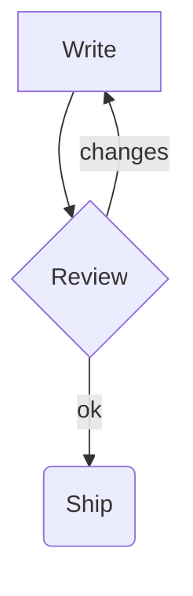

# mdv — Markdown viewer

A **fast** terminal viewer with *italic*, ~~strike~~, `inline code` and a [link](https://example.com).
Hard break here\
next line. Footnote reference[^1]. Math: $E = mc^2$ :rocket:

## Lists

- First item
- Second item with a long line that should wrap nicely when the terminal is narrow enough to require it
  - Nested item
    - Deeper item
- [ ] Todo task
- [x] Done task

1. One
2. Two
10. Ten

## Code

```rust
fn main() {
    println!("Hello, world!");
}
```

    indented code

## Table

| Name | Description | Price |
|:-----|:-----------:|------:|
| Apple | A red fruit that grows on trees | $1.20 |
| Banana | Yellow | $0.50 |

## Quotes

> A plain quote with **bold** text.
> > Nested quote.

> [!WARNING]
> Be careful with this.

> [!TIP]
> Useful hint.

---

Term
: Definition of the term.

$$
\sum_{i=1}^{n} x_i^2
$$

<p align="center"> Centered HTML</p>


### Third level

See [other doc](other.md) and [table section](#table).
#### Fourth level

[^1]: The footnote text.

## Diagram


